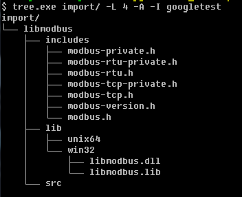
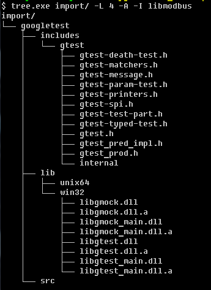

# IODriverLib

IODriverLib is a Simple C++ Lib for ModBus/Tcp (Client).

As additional options, it is planned to add functions for working with other communication protocols.
This library depends from [**libmodbus**](https://libmodbus.org/)

### Main features
- The driver makes periodic attempts to connect a modbus server;
- Asynchronous cyclic reading of group (s) holding registers (after connection);
- Asychronous writing of holding register (after connection);
- Registers have a timestamp;
- Registers have a quality.

### Example of using:

```c++
#include "iodriverlib.h"

#include <iostream>
#include <string>
#include <thread>
#include <chrono>
#include <memory>
#include <exception>

using std::cout;
using std::endl;

int main(int argc, char *argv[])
{
    auto lib = std::make_unique<IODriverLib>();
    // IODriver info
    cout << "------------------- Info -----------------" << endl;
    cout << lib->info();

    // Poll 5 modbus registers since address=0
    cout << "------------------- Poll -----------------" << endl;
    IDriver *drv = lib->createDriver("Modbus");
    // Modbus server: ip=127.0.0.1, port=502
    drv->setComConfigure("127.0.0.1:502");
    // range №1: 0..2 (3 registers)
    // range №2: 5..12 (8 registers)
    if (IDriver::Config::Ok != drv->setDataConfigure("{0,3} {5,8}"))
        cout << "Bad data config" << endl;
    cout << "Driver: " << drv->name() << endl;
    drv->start();
    cout << "Begin:" << endl;
    for (int i=0; i<5; i++) {
        std::this_thread::sleep_for(std::chrono::seconds(1));
        std::vector<IDriver::Data> datas = drv->readDatas();
        std::cout << "Number of ranges: " << datas.size() << endl;
        for (auto &data: datas) {
            cout << "[addr=" << data.addr << ", number=" << data.regs.size() << "] : ";

            for (uint16_t addr=data.addr; addr<data.addr+data.regs.size(); addr++) {
                    std::cout << data.regs.at(addr-data.addr) << " ";
                }
            cout << "(" << data.quality_to_string(data.quality) << ")" << endl;
        }
        cout << endl;
    }
    drv->stop();
    cout << "That's all" << endl;

    return  0;
}
```

The Modbus/TCP server has the following address map:

| address |  value  || address |  value  |
|---------|---------||---------|---------|
|   0     |   101   ||   10    |   111   |
|   1     |   102   ||   11    |   112   |
|   2     |   103   ||   12    |   113   |
|   3     |   104   ||   13    |   114   |
|   4     |   105   ||   14    |   115   |
|   5     |   106   ||   15    |   116   |
|   6     |   107   ||   16    |   117   |
|   7     |   108   ||   17    |   118   |
|   8     |   109   ||   18    |   119   |
|   9     |   110   ||   19    |   120   |

Console output:


### Building

#### Prerequisites
- [**libmodbus**](https://libmodbus.org/)
For installing libmodbus in Debian/Ubuntu type in terminal
~~~cmake
$ sudo apt-get update
$ sudo apt-get install libmodbus-dev
~~~
- [**googletest**](https://github.com/google/googletest.git) (optionally for testing)

The second way - to compile libraries and place its in the **import** folder in  the correspond subdirectory.
- import/googletest/bin,includes,src

- import/libmodbus/bin,includes,src

+ **bin** - executable and libraries files (exe, lib, so etc.)
+ **includes** - headers
+ **src** - sources (if exist)


#### Compilation in windows (MinGW)
1. Create and go to the **build** directory
~~~cmake
$ mkdir build && cd build
~~~
2. For building library execute the command:
~~~cmake
$ cmake .. -G "Unix Makefiles" mingw32-make.exe &&  mingw32-make.exe install
~~~
3. Build unit tests (if need). (Option **-DTEST=ON** enables building tests)
~~~cmake
$ cmake .. -G "Unix Makefiles" -DTEST=ON &&  mingw32-make.exe &&  mingw32-make.exe install
~~~
4. If you want to use another compiler you should specify it directly (For example MinGW from Qt)
~~~cmake
$ cmake .. -G "Unix Makefiles" -DCMAKE_CXX_COMPILER="C:/Qt/Qt5.11.2/Tools/mingw530_32/bin/g++.exe" -DCMAKE_MAKE_PROGRAM="C:/Qt/Qt5.11.2/Tools/mingw530_32/bin/mingw32-make.exe" && mingw32-make.exe &&  mingw32-make.exe install
~~~
5. Building unit tests)
~~~cmake
$ cmake .. -G "Unix Makefiles" -DCMAKE_CXX_COMPILER="C:/Qt/Qt5.11.2/Tools/mingw530_32/bin/g++.exe" -DCMAKE_MAKE_PROGRAM="C:/Qt/Qt5.11.2/Tools/mingw530_32/bin/mingw32-make.exe" -DTEST=ON &&  mingw32-make.exe &&  mingw32-make.exe install
~~~

#### Compilation in Linux (GCC)
1. Create and go to the **build** directory
~~~cmake
$ mkdir build && cd build
~~~
2. For building library execute the build command:
~~~cmake
$ cmake .. -DTEST=OFF && make && make install && cmake .. -DTEST=ON && make && make install
~~~

Result: binaries and headers will be foudn in **export** folder


### Testing 
1. Windows (MinGW)
~~~
$ mingw32-make.exe test
~~~
2. Linux (GCC)
~~~
$ make test
~~~
