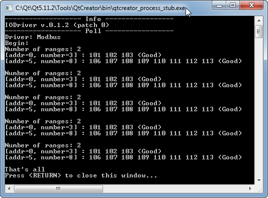

# IODriverLib

IODriverLib is a Simple C++ Lib for ModBus/Tcp (Client).

As additional options, it is planned to add functions for working with other communication protocols.
This library depends from [**libmodbus**](https://libmodbus.org/)

### Main features
- The driver makes periodic attempts to connect a modbus server;
- Asynchronous cyclic reading of group (s) holding registers (after connection);
- Asychronous writing of holding register (after connection);
- Registers have a timestamp;
- Registers have a quality.

### Example of using:

```c++
#include "iodriverlib.h"

#include <iostream>
#include <string>
#include <thread>
#include <chrono>
#include <memory>
#include <exception>

using std::cout;
using std::endl;

int main(int argc, char *argv[])
{
    auto lib = std::make_unique<IODriverLib>();
    // IODriver info
    cout << "------------------- Info -----------------" << endl;
    cout << lib->info();

    // Poll 5 modbus registers since address=0
    cout << "------------------- Poll -----------------" << endl;
    IDriver *drv = lib->createDriver("Modbus");
    // Modbus server: ip=127.0.0.1, port=502
    drv->setComConfigure("127.0.0.1:502");
    // range №1: 0..2 (3 registers)
    // range №2: 5..12 (8 registers)
    if (IDriver::Config::Ok != drv->setDataConfigure("{0,3} {5,8}"))
        cout << "Bad data config" << endl;
    cout << "Driver: " << drv->name() << endl;
    drv->start();
    cout << "Begin:" << endl;
    for (int i=0; i<5; i++) {
        std::this_thread::sleep_for(std::chrono::seconds(1));
        std::vector<IDriver::Data> datas = drv->readDatas();
        std::cout << "Number of ranges: " << datas.size() << endl;
        for (auto &data: datas) {
            cout << "[addr=" << data.addr << ", number=" << data.regs.size() << "] : ";

            for (uint16_t addr=data.addr; addr<data.addr+data.regs.size(); addr++) {
                    std::cout << data.regs.at(addr-data.addr) << " ";
                }
            cout << "(" << data.quality_to_string(data.quality) << ")" << endl;
        }
        cout << endl;
    }
    drv->stop();
    cout << "That's all" << endl;

    return  0;
}
```

<table> <tr> <th colspan="2">Console output</th> </tr> <tr> <td rowspan="16">  </td> </tr>
<tr> <td>addr=0, value=101</td> </tr>
<tr> <td>addr=1, value=102</td> </tr>
<tr> <td>addr=2, value=103</td> </tr>
<tr> <td>addr=3, value=104</td> </tr>
<tr> <td>addr=4, value=105</td> </tr>
<tr> <td>addr=5, value=106</td> </tr>
<tr> <td>addr=6, value=107</td> </tr>
<tr> <td>addr=7, value=108</td> </tr>
<tr> <td>addr=8, value=109</td> </tr>
<tr> <td>addr=9, value=110</td> </tr>
<tr> <td>addr=10, value=111</td> </tr>
<tr> <td>addr=11, value=112</td> </tr>
<tr> <td>addr=12, value=113</td> </tr>
</table>

### Installation
[**Installation in Linux**](doc/manuals/LinInstall/LinuxInstall.md)
[**Installation in Windows**](doc/manuals/WinInstall/WindowsInstall.md)

Destination directory:
+ **bin** - executable and libraries files (exe, lib, so etc.)
+ **includes** - headers
+ **src** - sources (if exist)

### Testing
1. Windows (MinGW)
~~~
$ mingw32-make.exe test
~~~
2. Linux (GCC)
~~~
$ make test
~~~

