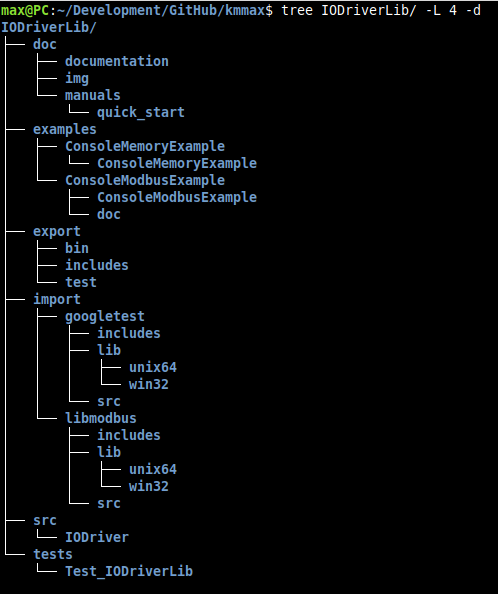
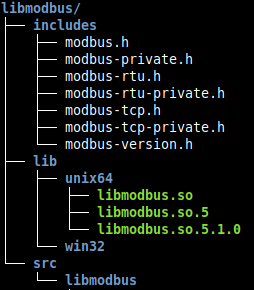
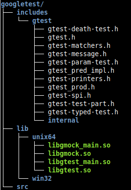
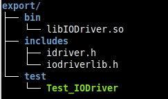

## Installation in Linux

You will only need to install automake, autoconf, libtool C++ compiler (gcc) and CMake

## 1 Installing by script

To install, just run the **./install.sh**

## 2 Installing manually
Or you can do it manually.

#### 1.1 Getting repository
Clone repository:
~~~bash
$ git clone https://github.com/kmmax/IODriverLib.git
~~~
Go to **IODriverLib** directory:
~~~bash
$ cd IODriverLib
$ ROOT=$PWD
~~~
We have the following project structure:

#### 2.2 Getting libraries
##### 2.2.1 libmodbus
go to download directory:
~~~bash
$ cd $ROOT/import/libmodbus/src/
~~~
download **libmodbus** repository:
~~~bash
$ git clone https://github.com/stephane/libmodbus.git
$ cd libmodbus
~~~
Build shared library:
~~~bash
$ ./autogen.sh
$ ./configure
$ make
~~~
Copy libraries and headers:
~~~bash
$ cp cp $ROOT/import/libmodbus/src/libmodbus/src/.libs/*.so* $ROOT/import/libmodbus/lib/unix64/
$ cp $ROOT/import/libmodbus/src/libmodbus/src/*.h -R $ROOT/import/libmodbus/includes/
~~~

##### 2.2.2 googletest 
go to download directory:
~~~bash
$ cd $ROOT/import/googletest/src/
~~~
clone **googletest** repository:
~~~bash
$ git clone https://github.com/google/googletest.git
~~~
Create **build** directory and go there:
~~~bash
$ mkdir build && cd build
~~~
Build shared library:
~~~bash
$ cmake ../googletest/ -G "Unix Makefiles" -DBUILD_SHARED_LIBS=ON && make
~~~
Copy libraries and headers:
~~~bash
$ cp $ROOT/import/googletest/src/build/lib/* $ROOT/import/googletest/lib/unix64/
$ cp $ROOT/import/googletest/src/googletest/googletest/include/* -R $ROOT/import/googletest/includes/
~~~
We have the following result:

#### 2.3 Building **IODriverLib**:
Go to the building directory:
~~~bash
$ mkdir $ROOT/build && cd $ROOT/build
~~~
Execute build command:
~~~bash
$ cmake .. -DTEST=OFF && make && make install && cmake .. -DTEST=ON && make && make install
~~~
Result:

#### 2.4 Setting libraries path in linux:
[wiki](https://github.com/kmmax/IODriverLib/wiki)
