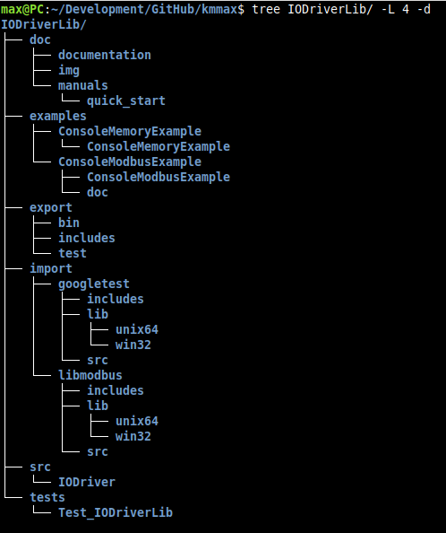
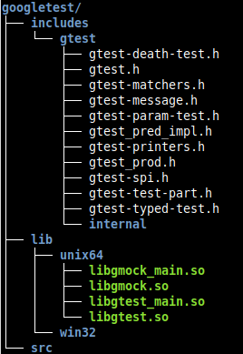
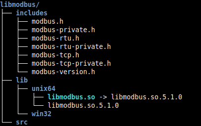
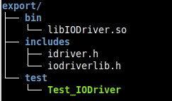

# Quick Start

### 1 Getting repository
Clone repository:
~~~bash
$ git clone https://github.com/kmmax/IODriverLib.git
~~~
Go to **IODriverLib** directory:
~~~bash
$ cd IODriverLib
$ ROOT=$PWD
~~~
We have the following project structure:

### 2 Getting libraries
#### 2.1 libmodbus
**add here ...**
We have the following result:

#### 2.2 building googletest
go to download directory:
~~~bash
$ cd $ROOT/import/googletest/src/
~~~
download **googletest** repository:
~~~bash
$ git clone https://github.com/google/googletest.git
~~~
Create **build** directory and go there:
~~~bash
$ mkdir build && cd build
~~~
Build shared library:
~~~bash
$ cmake ../googletest/ -G "Unix Makefiles" -DBUILD_SHARED_LIBS=ON && make
~~~
Copy libraries and headers:
~~~bash
$ cp $ROOT/import/googletest/src/build/lib/* $ROOT/import/googletest/lib/unix64/
$ cp $ROOT/import/googletest/src/googletest/googletest/include/* -R $ROOT/import/googletest/includes/
~~~
We have the following result:

### 3 Building **IODriverLib**:
Go to the building directory:
~~~bash
$ mkdir $ROOT/build && cd $ROOT/build
~~~
Execute build command:
~~~bash
$ cmake .. -DTEST=OFF && make && make install && cmake .. -DTEST=ON && make && make install
~~~
Result:

